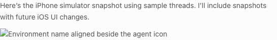
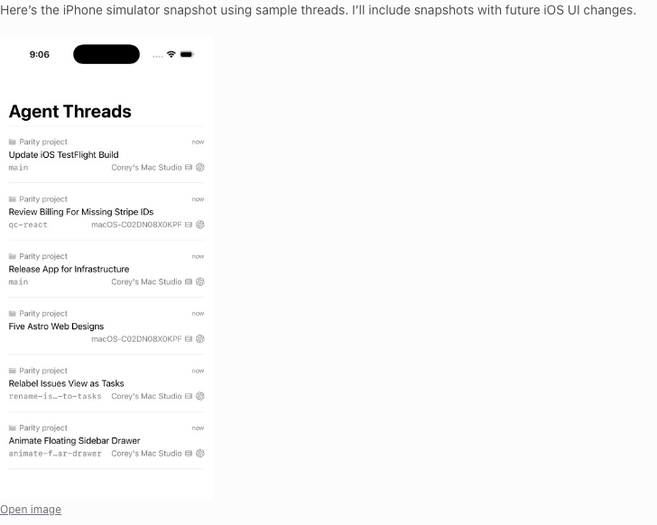
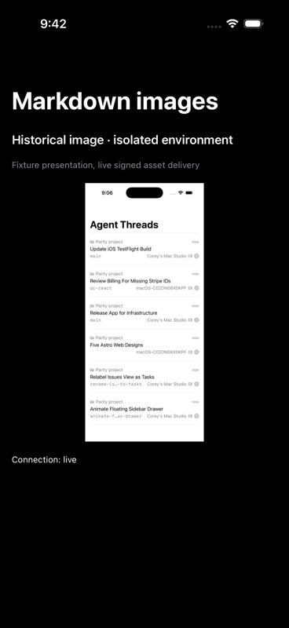

# Environment-local Markdown image evidence

The browser screenshots show the same historical agent message from an isolated, read-only copy of real Pathway data. No live state was modified.

| Before | After |
| --- | --- |
|  |  |

Before: the browser requested the filesystem path on the client origin, `http://localhost:5744`. Vite returned HTML and the image failed to decode. After: the rebased client requested a signed `/api/assets/` URL from the owning environment at `http://127.0.0.1:13773`, received HTTP 200, and decoded the image. These are different origins on the same machine.

[Video: opening and closing the existing image preview](preview.mp4)

## Native simulator

The iPhone 17 Pro screenshot uses a labeled fixture presentation with the real thread model, development identity, direct pairing, and signed HTTP delivery. It was captured before rebasing. This screenshot itself was successfully loaded through the corrected cross-origin Markdown image path.

## Validation

- Rebased branch: 122 focused tests passed across nine web, Markdown, runtime asset, and server asset suites. Web/server typechecks passed. Targeted lint reported five existing warnings.
- The historical message rendered through the full conversation UI, then passed reconnect and reload. Separate production-renderer fixtures passed reopen, missing-file fallback, bounded retry, and twenty streaming updates without additional asset requests.
- Before rebasing: native app build and ten focused Markdown/transcript-layout tests passed. An unrelated test file with existing optional-type errors was excluded.
- After rebasing: the native build is blocked by a Swift compiler type-check timeout at `AgentThreadsView.swift:41`. An untouched checkout of main at `d4414a240` produces the same error.
- Pathway Connect and managed tunnel delivery remain unverified because the configured development relay returned HTTP 502 and failed preflight during linking.
- Packaged Electron, iPad, and a Windows environment were not separately exercised. They use the shared renderers or tested path parsing.

Files must remain inside the authorized thread workspace. Temporary files are not archived, escaping symlinks remain denied, and unsupported `sandbox:` references have no resource mapping. Native reference-style image definitions remain unsupported.
