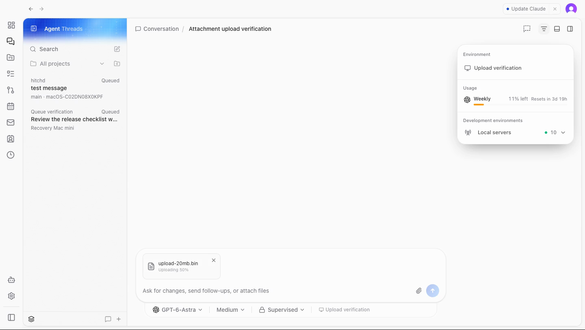
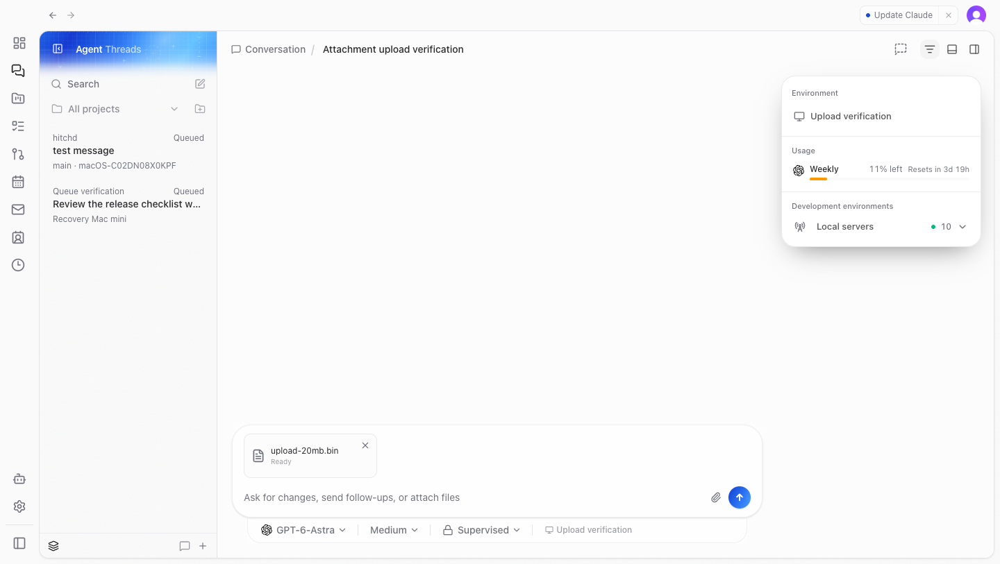

# Active-thread queue and attachment verification

Verified on 11 September 2026 in an isolated development server, local Convex deployment, and
Chromium with the dedicated Clerk development account. A synthetic existing conversation was
created without starting a provider turn. No live environment data was changed.

The before image uses the PR's initial composer implementation: selecting a 20 MiB file leaves
it showing only its size. The corrected composer starts the binary HTTP upload in the background,
shows progress, and reaches Ready. Upload bandwidth was limited to 2 MiB/s for the recording,
then restored. The file was uploaded to the isolated environment; no provider turn was submitted.
Build/Plan remains absent from this conversation's composer.

[Upload recording](attachment-upload.mp4)

Focused tests cover delivery routing and reconnect hydration, large-file transport, expired uploads,
existing queue controls, queue ordering, and atomic per-turn settings. Concurrent sends retain their
own permission and interaction settings through queue promotion. Targeted lint and scoped
web/client-runtime typechecks passed. Queued-run edit, steer, remove, and reorder controls were
verified by the existing focused tests; this browser pass specifically exercised attachment UI.
Desktop uses the same web composer; no separate Electron or native-mobile pass was performed.
