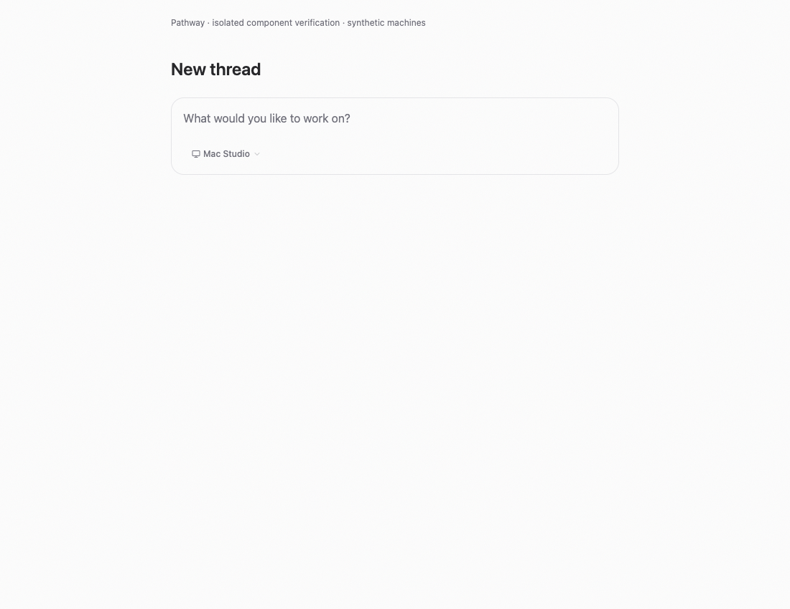
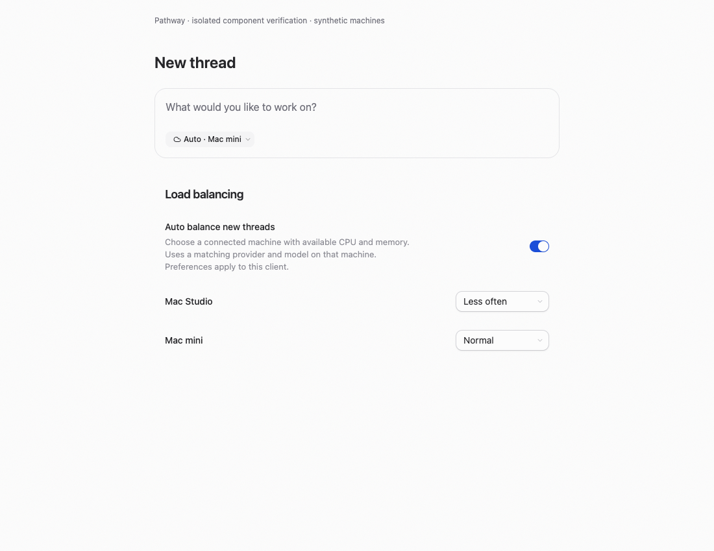
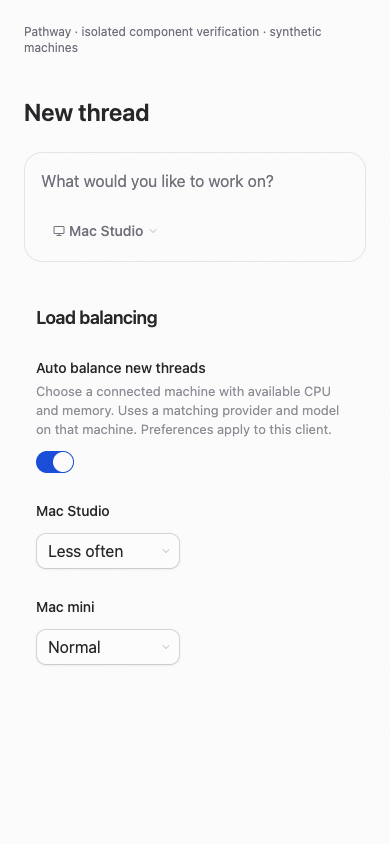

# New-thread placement verification

The upstream investigation is in [the research note](../load-balancing-research-2026-09-08.md). This change implements opt-in environment placement; subscription-aware account routing and recovery remain follow-ups.

## Automated checks

The latest launch-safety changes passed 147 tests across four focused files covering launch commands, draft state, and web placement. Earlier focused verification passed 325 tests across 12 files covering the sampler, authorization, contracts, selection policy, picker behavior, settings hydration, and desktop persistence. Scoped typechecks passed for contracts, client-runtime, server, web, and desktop. Targeted lint has no errors; four existing unused-variable warnings remain in the server and Connections files.

A real macOS sampler invocation returned valid CPU and memory values in a 143-byte JSON snapshot; the immediate second read reused the same cached sample. This verifies the local sampler, not a multi-machine launch.

All changed Swift source and test files pass syntax parsing. A standalone Swift 6 harness compiled the actual selector, resolver, and environment client with surrounding type stubs; it passed 11 shared scoring fixtures, three direct-probe cleanup cases with zero subscriptions, two checkout-selection cases, and five scope/read-only probe cases. The native XCTest file adds 20 test functions covering 23 cases, but the XCTest suite and complete app build have not run.

## Browser evidence

The screenshots use an isolated React component harness with two synthetic machines. The before environment selector is the unchanged source from base commit `4755a6512`. The after selector and settings are the implementation components, using the real browser client-settings persistence. The harness supplies the selected destination; it does not exercise the composer placement hook or a live RPC. Layout combines the composer selector and settings for review; it is not a screenshot of the complete Settings page.

Headless Helium driven by Playwright verified toggle on/off, preference selection, persistence after reload, Auto selection, and a 390px viewport with no horizontal overflow. No browser page errors occurred. The normal Pathway preview tool failed to open a tab, so the isolated browser used a separate temporary profile.

| Before                                     | After                                                   |
| ------------------------------------------ | ------------------------------------------------------- |
|  |  |

[Short component interaction recording](interaction.webm) shows enabling Auto, changing a weight, selecting Auto, reloading preferences, and disabling the feature. It uses the same isolated harness as the screenshots.

## Manual verification

The maintainer will perform full app and native verification. This machine has no configured Clerk development login, and Xcode's license setup is incomplete. Native simulator builds and XCTest execution are therefore not claimed by these screenshots or source checks.

1. Start with Auto off and confirm ordinary creation from chat, sidebar, command palette, and keyboard shortcuts still works.
2. Connect two environments with active bindings to one company project and authenticated providers. Use different provider instance IDs with the same model. Enable Auto and start a new thread; confirm its displayed and actual launch environment agree.
3. Register two checkouts of the same project on one environment. Recheck and confirm the current checkout stays selected; ambiguous remote checkouts require manual selection. Change machine weights and set one to Manual only. Recheck Auto. Verify preferences survive client restart and the excluded machine remains manually selectable.
4. Change model/options while a probe is outstanding. Inherit a custom account from the project default or sticky selection and confirm it stays selected. Select an account, branch/worktree, or attachment. Confirm a late result does not move that draft.
5. Try an offline or older server, a saturated machine, no eligible destination, a rootless project, and unrelated projects grouped in the sidebar. Confirm drafts remain recoverable through explicit manual selection.
6. Fail attachment preparation before launch, remove the failed attachment, and confirm Auto/manual placement is available again. Interrupt the connection during launch, then retry and reload. Confirm the draft stays bound to its original destination and no second environment starts the work.
7. Pair an iOS direct connection with read scopes only and confirm Auto excludes it and cannot prepare a launch. Repeat new-thread selection and explicit manual recovery on iOS, including a saved draft and a pending launch. Clear an empty draft’s attachments and branch, return to Current checkout, and choose Auto explicitly to clear its historical pin. Verify the account-change explanation and preserved model/options/access mode. Exercise direct remote and relay/tunnel connections.

The sampler reads a small whole-host snapshot on demand with a five-second shared cache. It adds no idle polling or process-tree subscription. Native placement reads use short-lived direct RPC connections and never subscribe to the issue database. Placement occurs on the client before the existing environment-local launch operation. Server deployments must support the new RPC to participate in Auto; manual placement remains available for older servers.
