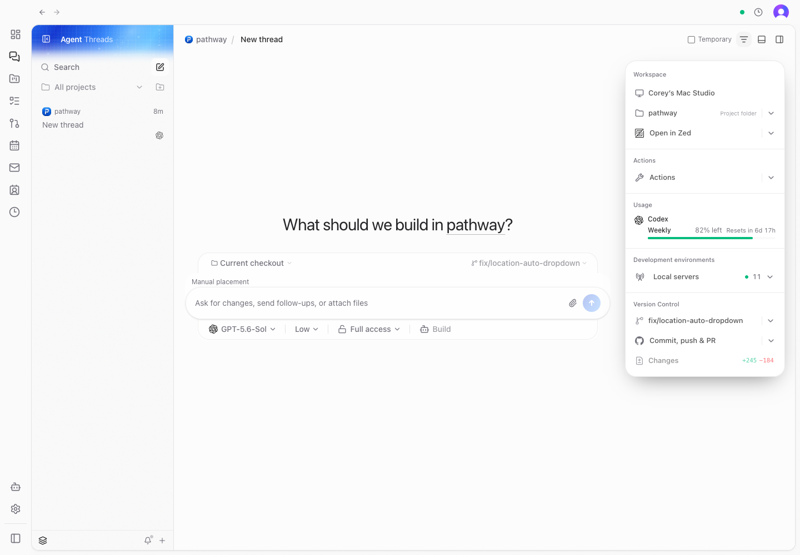
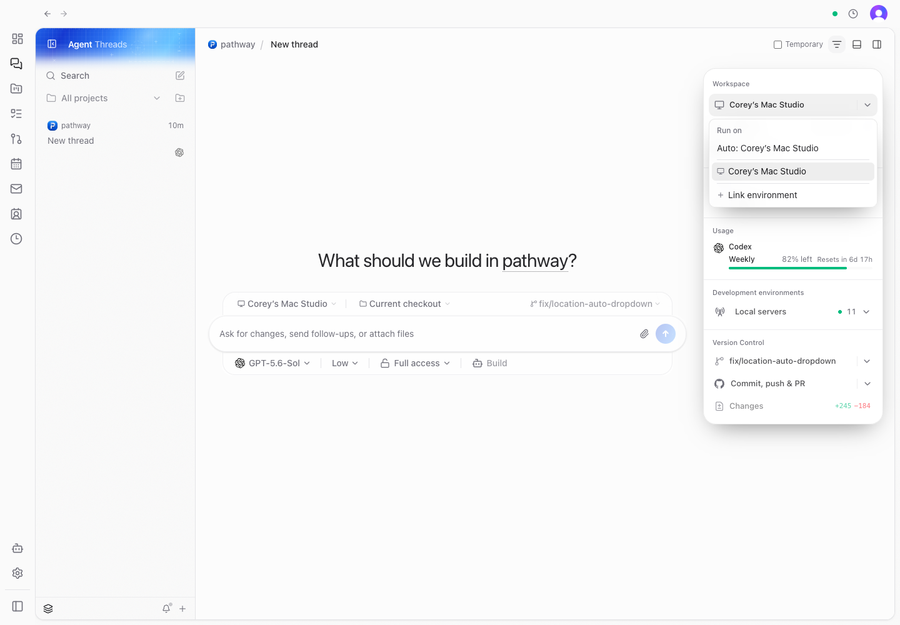
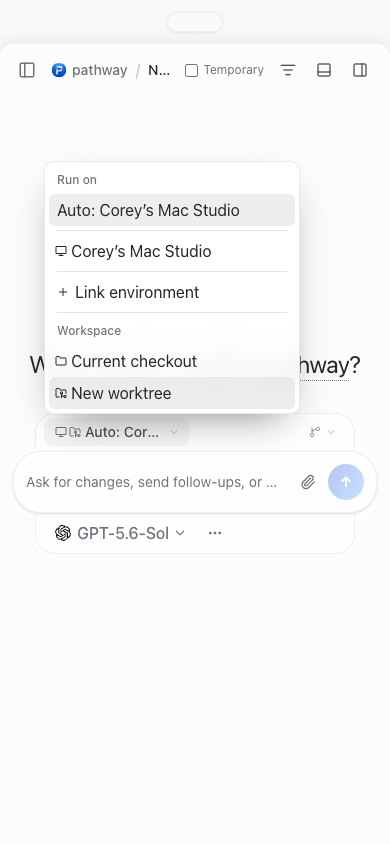

# Draft location dropdown verification

These screenshots show the real Pathway web app at 1440 × 1000 and 390 × 844, driven with Playwright in a separate headless Chrome profile. The in-app preview could not open a tab. The browser signed into the provisioned Clerk development account and paired with an isolated local server.

The scenario uses one connected environment and a checkout of this repository. Setup selected the existing All companies scope and enabled load balancing through client settings persistence, since the Settings toggle is hidden when only one environment is connected. The composer, menus, placement hook, provider discovery, and host-resource RPC are real. No agent turn was sent and no multi-machine dispatch was exercised.

The before capture uses the affected components from `ad9c8b458`. The after captures use this branch's implementation. The source files were restored after the comparison.

| Before                                                                           | Auto selected                                                   |
| -------------------------------------------------------------------------------- | --------------------------------------------------------------- |
|  |  |

Verified through the UI:

- A new project draft resolves Auto to the connected machine.
- The composer and workspace panel support Auto → manual → Auto.
- Choosing New worktree leaves location selection enabled.
- The narrow-screen menu supports manual selection and returning to Auto, with no horizontal overflow at 390 pixels.
- The separate Manual placement row is absent.

Focused automated validation passed 117 tests across the placement hook, placement helpers, location selector, and toolbar logic. The web typecheck and targeted lint passed. The tests cover distinct provider IDs across environments, manual-only weights, late automatic results, and launch locking. Native iOS was not changed or tested for this PR.
