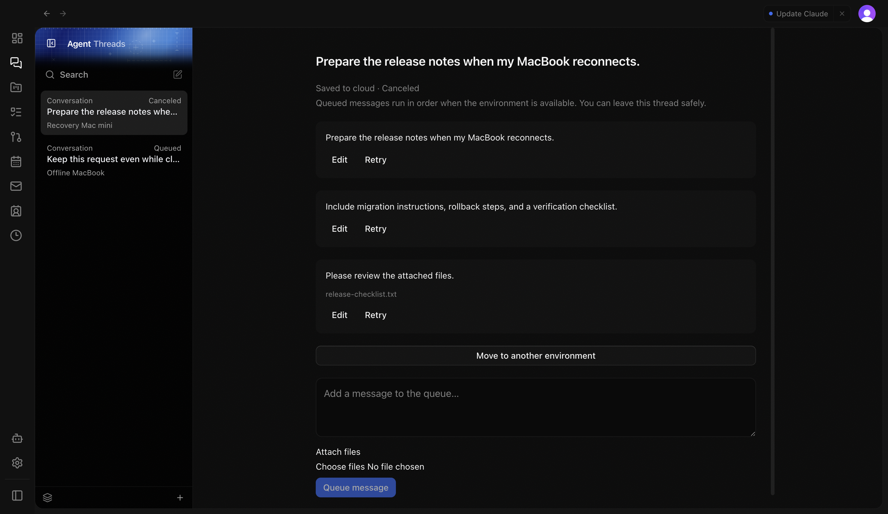
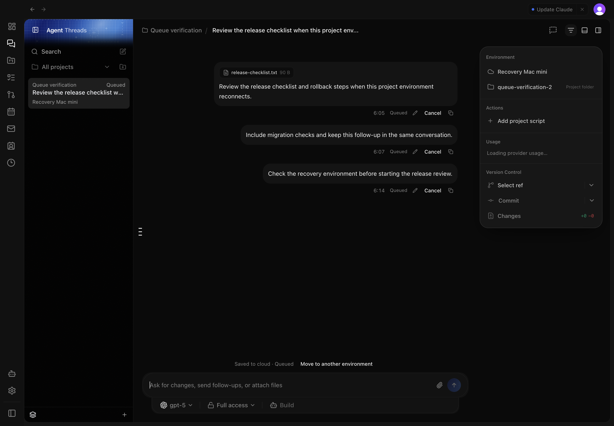

# Durable queue verification

Verified on 10–11 September 2026 using an isolated Pathway worktree, local Convex backend, development
Clerk account, and Helium. Two synthetic registered environments remained disconnected throughout
the browser pass. No production backend was deployed or used for the queue fixtures.

- Created a conversation for a registered offline environment from the normal new-thread picker.
- Saved multiple messages and an attachment to cloud without connecting that environment.
- Edited a queued message, canceled an attachment message, and retried it successfully.
- Moved the unstarted thread to a different registered environment while retaining its thread ID
  and all pending messages.
- Stopped the isolated Convex backend, saved another prompt and file on the device, then restarted
  cloud. The outbox synced the saved request and file without re-entering either.
- Navigated to Settings and back, switched between queued threads, and reloaded the application.
  Messages remained accessible in the sidebar.

The integration was revised to use the ordinary conversation timeline and composer on web,
desktop, and native clients. The normal composer remains visible while the thread is Starting,
Queued, or waiting for its server projection. The follow-up browser pass verified offline project
creation with a file, ordered follow-ups, inline editing, cancellation/retry, attachment download,
and moving the same thread to another project environment. Navigation and reload retain the
messages and normal composer.

The before image shows the separate queue screen that was removed. The after image shows the
same feature using normal messages, attachment chips, and the regular composer. The video records
navigation away and back to the queued conversation.

[Navigation recording](navigation.mp4)

Focused automated verification covered 47 backend/registry tests, 139 web/shared-client tests,
57 server tests, 9 native queue tests, and 10 native draft-recovery tests across targeted runs.
Scoped TypeScript checks and lint passed. iPhone, iPad, and visionOS builds passed; the three new
Swift files passed SwiftFormat and strict SwiftLint.

The normal-view correction additionally passed 186 focused web tests and 19 cloud queue tests,
including queue ordering, cold thread shells, draft hydration, and attachment authorization.

Native tests excluded the unrelated, pre-existing noncompiling `PathwayProjectIconTests.swift`.
The visionOS build retained an existing camera-usage-description warning. Provider execution and
reconnection ownership were verified with focused server tests, not a live provider through a
production tunnel. Desktop uses the tested web implementation; no separate Electron shell pass
was performed.
