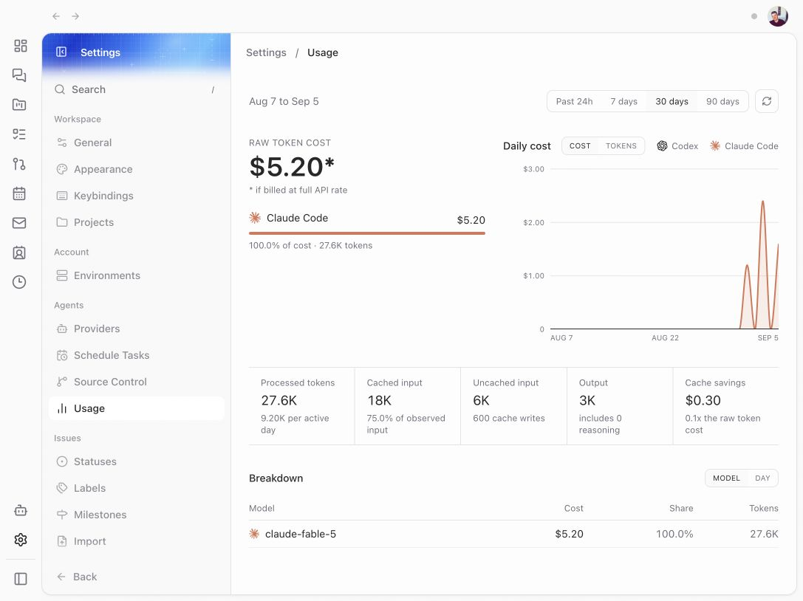
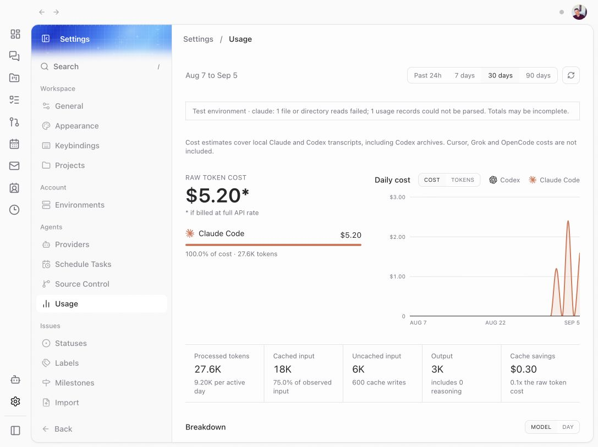

# Usage integrity browser evidence

The isolated development app was checked in the in-app browser on 5 September 2026.

- Settings → Providers: quota loading completes, Codex general and model-specific buckets stay separate, and manual refresh completes.
- Agent Threads → draft thread details: the compact meter expands into the same quota buckets and manual refresh completes. Unauthenticated Claude is hidden from this section. Switching from Sol to Spark reveals the Spark quotas; switching back hides them. No provider turn was submitted.
- Top profile dropdown → Provider usage: account/environment summaries load and hide Spark quotas. Provider Settings retains the Spark quotas.
- Settings → Usage: transcript totals load and manual refresh completes.

The screenshots below use the same synthetic transcript summary. The source is deliberately partial, demonstrating the new coverage notice. The fixture was removed after capture. Live credentials, account email addresses and real usage history are not included in these images.

## Before

Baseline `c39ca9a56`, with no visible warning for the partial source.

## After

The dashboard explains the incomplete source and which providers contribute transcript cost estimates.

## Verification limits

Web was exercised against a local isolated server. The Electron shell, native mobile client, remote/relay transport and automatic retry of an actual rate-limited provider turn were not exercised in the browser. The quota components are shared by the web and desktop wrapper; provider and recovery behavior has focused automated coverage. Development-backend warnings about missing Convex focus functions were unrelated to usage and did not prevent these checks.
